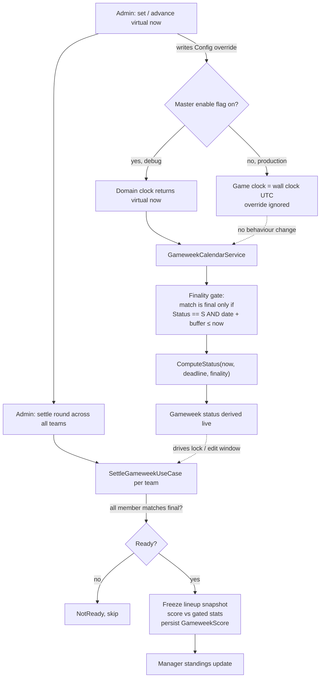
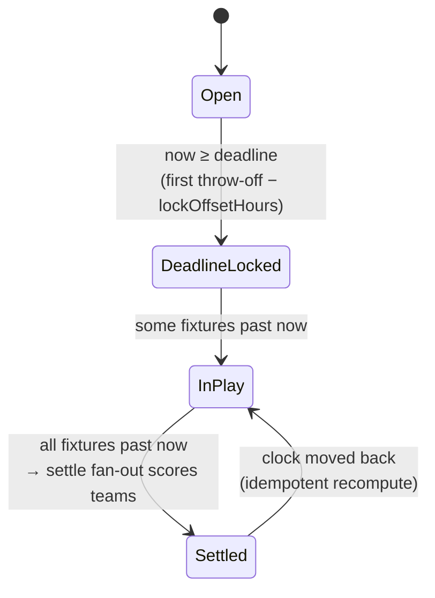

# Time-shift season replay harness

Tracking: epic [#93](https://github.com/kromby/Ez.Handball.Backend/issues/93), sub-tasks [#94](https://github.com/kromby/Ez.Handball.Backend/issues/94) (domain clock), [#95](https://github.com/kromby/Ez.Handball.Backend/issues/95) (finality gate), [#96](https://github.com/kromby/Ez.Handball.Backend/issues/96) (advance-and-settle fan-out).

## How to use it

Flip the master enable flag on in a non-production environment (it stays off in prod appsettings), then set the virtual `now` to just before round 1 of the season you want to replay, for example the finished 2025-26 Olís deild karla. The whole league is already in the tables, but because match finality is gated by virtual `now` nothing has "happened" yet, so every gameweek reads `Open`. Walk the season forward with the admin advance-and-settle control: each step pushes the clock to the next round boundary, which locks that week and freezes lineups, flips its fixtures to final as their kickoff times pass, and then settles every team so per-round scores and the manager standings update. Repeat until the season ends, inspecting the gameweek states and scores at any point, and move the clock backwards whenever you want to recompute a round. Note that backwards travel re-scores idempotently but does not undo mutable manager state like transfers or chips, so use a fresh team or a season reset for a clean run.

## How it works

The clock and the data are the same single knob. Advancing virtual `now` is what both locks a week and makes its results count, so the gameweek state machine plays out on its own:

## Why not delete-and-re-ingest

Re-ingesting rounds from blob storage replays only the results axis and leaves every historical week pre-locked (real `now` is past all last-season deadlines), plus it mutates stored data and is not cleanly reversible. The finality gate replays both the time axis and the results axis from one control, touches no data, and is a no-op in production because real future matches are not final anyway. Blob re-ingest (`ReparseFunction`) stays the tool for rebuilding the stats data itself, not for simulating time.
