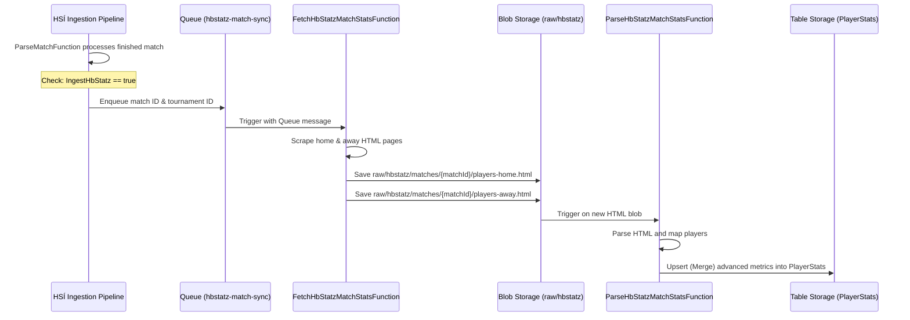
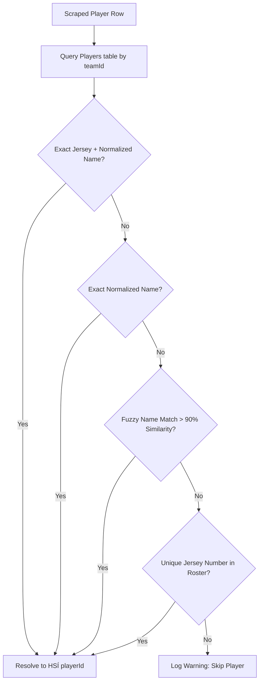

# HBStatz per-game player stats database storage — Design Spec

**Date:** 2026-07-18
**Project:** Ez.Handball.Backend (Ingestion & Domain)
**Scope:** Persisting raw scraped per-game player statistics from HBStatz into Azure Table Storage.
**Tracking Issue:** Part of [Backend #7 - HBStatz data integration](https://github.com/kromby/Ez.Handball.Backend/issues/7)

---

## 1. Goal

Integrate a decoupled, asynchronous ingestion pipeline that fetches per-game player statistics from `hbstatz.is`, parses the HTML reports, reconciles player names with the existing HSÍ database `Players` table, and persists the advanced statistics directly into the existing `PlayerStats` table.

This enables advanced metrics (such as assists, turnovers, steals, blocks, stops, saves, xG, xS, and plus/minus) to be available in the fantasy scoring engine and player profiles.

---

## 2. Ingestion Flow Architecture

To keep the core ingestion pipeline resilient against site changes or downtime on `hbstatz.is`, the fetching and parsing of HBStatz data will be fully decoupled via a storage queue.



### Detailed Component Roles:

1.  **Queue Message Dispatcher (`ParseMatchFunction`)**:
    *   Once a match details file is successfully parsed and written to the `Matches` table, the function checks:
        *   Is the match status `Finished` (Status = `"S"`)?
        *   Does the tournament's `TournamentEntity` in the database have `IngestHbStatz == true`?
    *   If both are true, it writes a JSON message containing the `MatchId` and `TournamentId` to the Azure Storage Queue `hbstatz-match-sync`.

2.  **Scraper Function (`FetchHbStatzMatchStatsFunction`)**:
    *   Triggered by messages in the `hbstatz-match-sync` queue.
    *   Fetches the team report HTML pages:
        *   Home: `https://hbstatz.is/test6b.php?ID={matchId}`
        *   Away: `https://hbstatz.is/test7b.php?ID={matchId}`
    *   Saves the raw HTML strings directly into Blob Storage at:
        *   `raw/hbstatz/matches/{matchId}/players-home.html`
        *   `raw/hbstatz/matches/{matchId}/players-away.html`
    *   *Self-healing:* Standard queue retry policies handle network glitches or temporary downtime on the scraped site.

3.  **Parsing & Merging Function (`ParseHbStatzMatchStatsFunction`)**:
    *   Triggered on new blobs matching: `raw/hbstatz/matches/{matchId}/players-{side}.html` (where `side` is `home` or `away`).
    *   Reads the HTML blob and invokes the parsing logic.
    *   Reconciles the scraped player stats with the corresponding players in that team (using the matching strategy in Section 4).
    *   Performs an **upsert with TableUpdateMode.Merge** to the `PlayerStats` table. This ensures existing goal/card data (from HSÍ) is preserved, and only the new HBStatz metrics are written.

---

## 3. Data Model & Schema Extensions

We will extend two entities to support the dynamic scraping configuration and store the richer HBStatz metrics.

### 1. `TournamentEntity` (Azure Table: `Tournaments`)
We will add a new property to control which tournaments should be scraped from HBStatz:
*   `IngestHbStatz` (bool): If `true`, the pipeline will schedule/enqueue this tournament's finished matches to retrieve statistics from HBStatz. Defaults to `false`.

### 2. `PlayerStatEntity` (Azure Table: `PlayerStats`)
We will extend `PlayerStatEntity` (and `PlayerStat` in the Domain layer) to include the new metrics. Since Azure Table Storage is schema-less, existing rows without these columns will simply have null/default values.

The new properties will cover both outfield players and goalkeepers:

*   **General Metrics (Applicable to BOTH Outfield & Goalkeepers):**
    *   `Assists` (int?): Stoðendingar (`Sto` for outfield, `Stoð` for GK)
    *   `Turnovers` (int?): Tapaðir boltar (`TB` for both)
    *   `Steals` (int?): Stolnir boltar (`Stl` for both)
    *   `PlusMinus` (double?): Plus/Minus differential (`+/-` for both)
*   **Outfield-Specific Metrics:**
    *   `Shots` (int?): Skot (`Skot`)
    *   `Blocks` (int?): Varin skot í vörn (`Blk`)
    *   `Stops` (double?): Lögleg stopp (`Stp`)
    *   `ExpectedGoals` (double?): Expected goals (`xG`)
    *   `PenaltiesEarned` (int?): Skaffað víti (`Sk.F` / `FiV` / `S7m`)
    *   `PenaltyGoals` (int?): Víti mörk (`Víti`)
*   **Goalkeeper-Specific Metrics:**
    *   `Saves` (int?): Varin skot (`Varin`)
    *   `SaveRate` (double?): Save percentage (`% Varsla`)
    *   `ExpectedSaves` (double?): Expected saves (`xS`)
    *   `GoalsAgainst` (double?): Mörk á vörslu (`Mörk á`)
    *   `PenaltySaves` (int?): Varin víti (`Víti Varin`)

---

## 4. Player Identity Matching & Reconciliation

Because HBStatz does not provide numeric player IDs, we must reconcile scraped players with the existing HSÍ `Players` in our database. We know the `teamId` (e.g. `123-karlar`) and `matchId` from the match context.

We will fetch the team's roster from the `Players` table (partitioned by `teamId`) and apply the following matching strategy:



### Detailed Matching Strategy:

1.  **Normalization Pre-processing**:
    *   To prevent diacritic and casing mismatches, both the scraped name and database name will be normalized:
        *   Trim whitespace.
        *   Convert to lowercase.
        *   Normalize Unicode (Form C / NFC).
        *   Strip accents/diacritics if necessary (e.g., `ó` -> `o`) for a secondary comparison if the diacritic match fails.
2.  **Step 1: Match on Jersey + Name**:
    *   Look for a player in the roster where the parsed jersey number matches `JerseyNumber` and the normalized name matches `Name`.
3.  **Step 2: Match on Name only**:
    *   If no match, look for a player where only the normalized name matches. (Sometimes players change jersey numbers for a match).
4.  **Step 3: Fuzzy Name Match**:
    *   If name spelling varies slightly (e.g. due to patronymic abbreviations or missing diacritics), calculate the Levenshtein or Jaro-Winkler distance. If the similarity is above **90%**, we match them.
5.  **Step 4: Unique Jersey Match**:
    *   If there's still no match but the scraped jersey number is unique and exists in the roster, match them.
6.  **Unmatched Fallback**:
    *   If a scraped player cannot be reconciled, log a warning: `Warning: Could not reconcile HBStatz player "{Name}" (Jersey {Jersey}) for team {teamId} in match {matchId}`. Skip writing advanced stats for this player.

---

## 5. Code Integration & Dependency Injection

We will migrate and adapt the parsing and client code from the `HbStatz.Spike` tool into the main production ingestion project (`Ez.Handball.Ingestion`).

### 1. Components to Migrate:
*   **Clients (`Ez.Handball.Ingestion/Services/`)**:
    *   `HbStatzClient.cs` / `IHbStatzClient.cs`: Handles HTTP client requests to `hbstatz.is`.
    *   `MatchReportClient.cs` / `IMatchReportClient.cs`: Fetches the team report HTML pages.
*   **Parsers (`Ez.Handball.Ingestion/Parsing/`)**:
    *   `StatsTableParser.cs`: Standard HTML table extractor.
    *   `MatchStatLineBuilder.cs`: Reconciles GK and outfield offensive/discipline tables into structured player lines.

### 2. Dependency Injection Setup (`Ez.Handball.Ingestion/Program.cs`)
We will register the new scraper client:
```csharp
services.AddHttpClient<IHbStatzClient, HbStatzClient>(client =>
{
    client.BaseAddress = new Uri("https://hbstatz.is/");
    client.DefaultRequestHeaders.UserAgent.ParseAdd("EzHandball-Ingestion/1.0 (+https://github.com/kromby/Ez.Handball.Backend)");
});
services.AddSingleton<IMatchReportClient, MatchReportClient>();
```

---

## 6. Verification and Test Plan

1.  **Unit & Integration Tests**:
    *   Write parser unit tests using fixtures (`12922-home.html`, `12922-away.html`) to ensure outfield and goalkeeper stats are parsed into `PlayerStatEntity` fields correctly.
    *   Write player reconciliation unit tests covering:
        *   Exact Jersey + Name matches.
        *   Name-only matches.
        *   Fuzzy name matches.
        *   Unmatched fallbacks.
2.  **Pipeline E2E Verification**:
    *   Scrape a real game locally (e.g. `12922`) through the queue-triggered flow in Azure Functions and verify the resulting table storage entity contains all the advanced metrics.
